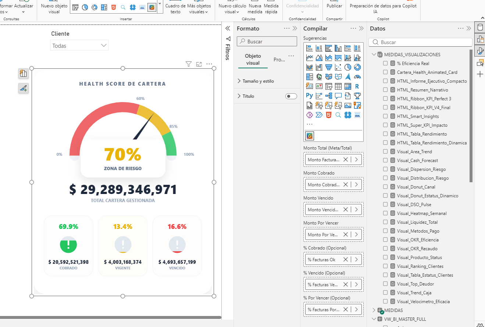
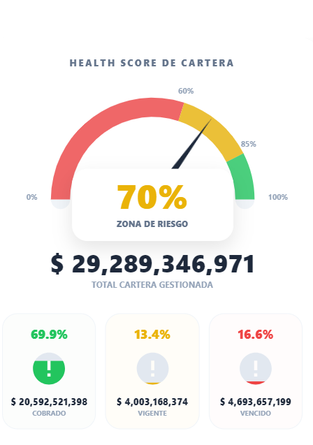

# 🦖 Health Score Cartera KPI 🚀

> **Potencia tu análisis financiero:** Visual de alto rendimiento diseñado para Dashboards Ejecutivos. Muestra el estado de la cartera (💚 Saludable, 🟡 Riesgo, 🔴 Crítica) mediante un Gauge animado y tarjetas de llenado líquido de última generación.

---

## 📊 Vista Previa del Visual

---

## 📜 Política de Privacidad

> [!IMPORTANT]
> **Declaración oficial de seguridad:** Este visual no recolecta ni envía datos del usuario fuera de Power BI. Todos los datos se procesan localmente en el dispositivo del usuario de forma segura dentro del ecosistema de Microsoft.

Garantizamos que ninguna información sensible es transmitida a servidores externos, cumpliendo estrictamente con las normativas de **Microsoft AppSource**.

---

## 🎧 Canales de Soporte Técnico
¿Tienes preguntas o necesitas una personalización? Estamos listos para ayudarte:

| Canal | Enlace |
| :--- | :--- |
| 📱 **WhatsApp** | [Chat Directo](https://wa.me/18098706366) |
| 🔗 **LinkedIn** | [Perfil Profesional](https://www.linkedin.com/in/juancitopeña/) |
| 📧 **Email** | [juancito.pena@hotmail.com](mailto:juancito.pena@hotmail.com) |
| 🐙 **GitHub** | [Reportar un Problema](https://github.com/juancitopena) |
| 📺 **YouTube** | [Video Tutoriales](https://www.youtube.com/@juancitopena) |

---

## 👨‍💻 Desarrollado por:

<table border="0">
  <tr>
    <td width="130">
      
    </td>
    <td>
      <strong>Ing. Juancito Peña Vizcaíno 🦖</strong> 
      <em>Lead Developer & Mentor</em> 
      Arquitecto educativo | Líder tecnológico 
      Especialista en dashboards de alto impacto y análisis de datos.
    </td>
  </tr>
</table>

---
© 2026 **CarteraHealthMaster** | Diseñado con excelencia por Ing. Juancito Peña Vizcaíno
